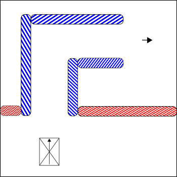

# Benchmark definition for automatic navigation
============
Author: Okke Hendriks

Date: 

Location:

Tester: 

Introduction
------------

In order to benchmark the automatic navigation software a set of well defined test situations is required.
This document intends to provide these situations.

Grading of the benchmarks

* Reaching goal (yes/no)
* # collisions
* Time (seconds)
* Smoothness (subjective 0 - 10)

## Abbreviations
* IR - inscribed radius of the robot
* CR - circumscribed radius of the robot
* MW - minimal, driving direction, width of the robot

Test Area
---------
The test area is an area cordoned off by walls all around. These walls are also present in the 'global map' which the robot is given beforehand.
The arrow on each picture is the goal pose, a pose is a position combined with a certain orientation. The ground is assumed to be flat and easy for the robot to drive on. Obstacles must all be visible to the sensors of the robot as long positions its sensors correctly, within their specified range. Thus if a certain robot only has a laser scanner for example, all obstacles must be well reflective and of enough height to be detected by the laser scanner.

Simple Goal Benchmarks
----------

These benchmarks test the ability of the automatic navigation to navigate to a simple goal pose in an open area.

These test assume that in all situations the localization of the robot, aka its pose estimate in the world, is reasonably good.

### Simple
#### Simple 1
##### Environment setup
Move to the goal in a test area without any obstacles.

Situation with both the robot and the goal at orientation zero degrees.

The goal is given 4 CR forward from the start pose. The test is repeated with varying orientations of the robot start pose and the goal pose.

| Orientation Robot | Orientation Goal | Reached | # collisions | Time | Smoothness |
| ----------------- | ---------------- | ------- | ------------ | ---- | ---------- |
| 0 				| 0 			   |         |              |      |            |
| 90 				| 0 			   |         |              |      |            |
| 180 				| 0 			   |         |              |      |            |
| 0 				| 90 			   |         |              |      |            |
| 90 				| 90 			   |         |              |      |            |
| 180 				| 90 			   |         |              |      |            |
| 0 				| 180 			   |         |              |      |            |
| 90 				| 180 			   |         |              |      |            |
| 180 				| 180 			   |         |              |      |            |

#### Simple 2
Move to the goal in a test area with one obstacle extruding from the left side of the area.

Situation with both the robot and the goal at orientation zero degrees. The extrusion obstacle is placed half way from the robot to the goal. The gap on the right side of the testing area is twice the CR.

The goal is given 4 meters away from the robot. The test is repeated with varying orientations of the robot start pose and the goal pose.

| Orientation Robot | Orientation Goal | Reached | # collisions | Time | Smoothness |
| ----------------- | ---------------- | ------- | ------------ | ---- | ---------- |
| 0 				| 0 			   |         |              |      |            |
| 90 				| 0 			   |         |              |      |            |
| 180 				| 0 			   |         |              |      |            |
| 0 				| 90 			   |         |              |      |            |
| 90 				| 90 			   |         |              |      |            |
| 180 				| 90 			   |         |              |      |            |
| 0 				| 180 			   |         |              |      |            |
| 90 				| 180 			   |         |              |      |            |
| 180 				| 180 			   |         |              |      |            |

### Replanning
These benchmarks will test the replanning behavior.

#### Replanning 1

The start pose is aligned with the left side of the red obstacle. The goal pose is placed 3 CR to the right and forward of the start pose.
The blue obstacle is hidden from sight by the red obstacle, and thus unknown to the robot at the beginning of the test.
The gaps on the right and left side of the red obstacle are at least twice the CR.
The path left from the robot will be the preferred initial path of the robot due to the lower distance. When the obstacle around the corner is detected however the robot should re-plan and take the path to the right of the red obstacle.

This test can be tested with variable width of the red obstacle. A larger width will increase the 'detour' the robot has to take in order to reach the goal

| Red obstacle width | Reached | # collisions | Time | Smoothness |
| ------------------ | ------- | ------------ | ---- | ---------- |
| 4 CR 				 |         |              |      |            |
| 8 CR 				 |         |              |      |            |
| 16 CR 			 |         |              |      |            |

### Unreachable goal

These benchmarks will test whether the robot can successfully detect if a goal is unreachable. As soon as it can detect that a goal in unreachable it must abort the navigation attempt.

#### Unreachable 1

In this benchmark the robot should immediately recognize that a goal is unreachable because the goal is outside the walls of its 'global map'.
The measured time is the time it takes for the robot to abort the navigation attempt. If the robot moves this is to be measured as not smooth. 

| Aborted | # collisions | Time | Smoothness |
| ------- | ------------ | ---- | ---------- |
|         |              |      |            |

#### Unreachable 2

The distance between the start pose and the goal pose must be 5 CR.
The red obstacle is extends 2 CR to the right of the start pose.
The blue obstacle is hidden from sight by the red obstacle, and thus unknown to the robot at the beginning of the test.
The gap on the right side of the red obstacle is at least twice the CR.
The robot will have to plan a path around the red obstacle, as soon as it detects the blue obstacle it must recognize that the goal is in fact unreachable and correctly abort its navigation attempt.
The measured time is the time it takes for the robot to abort the navigation attempt.

| Aborted | # collisions | Time | Smoothness |
| ------- | ------------ | ---- | ---------- |
|         |              |      |            |

### Narrow passages
These benchmarks will test whether the robot can pass through a narrow passage like an opened door.

#### Narrow passage 1

The distance between the start pose and the opening must be 4 CR.
The distance between the opening and the goal pose must be 4 CR.
The spacing between the red obstacles, the passage width, must be varied by a factor of the MW. 

| Passage width | Reached | # collisions | Time | Smoothness |
| ------------- | ------- | ------------ | ---- | ---------- |
| 150% MW       |         |              |      |            |
| 120% MW       |         |              |      |            |
| 110% MW       |         |              |      |            |

### L-shaped passages
This will test the scenario when there is a door standing open to the side of a narrow passage.

#### L passage 1

The distance between the start pose and the opening must be 4 CR.
The distance between the opening and the goal pose must be 2 CR.
The obstacle protruding out from the side of the passage must be at least twice the CR.
The spacing between the red obstacles, the passage width, must be varied by a factor of the minimal width. 

| Passage width | Reached | # collisions | Time | Smoothness |
| ------------- | ------- | ------------ | ---- | ---------- |
| 150% MW       |         |              |      |            |
| 120% MW       |         |              |      |            |
| 110% MW       |         |              |      |            |

### Narrow corridors
####  Narrow corridor 1

The length of the short edges of the corner, the blue obstacles, must be twice the CR.
The spacing between the blue obstacles, the passage width, must be varied by a factor of the MW.

| Passage width       | Reached | # collisions | Time | Smoothness |
| ------------------- | ------- | ------------ | ---- | ---------- |
| 150% MW             |         |              |      |            |
| 120% MW             |         |              |      |            |
| 110% MW             |         |              |      |            |

### Tight corners

#### Tight corner 1

The distance between the start pose and the opening of the blue obstacles must be 2 CR.
The distance between the opening at the end of the corner and the goal pose must be 2 CR.
The spacing between the blue obstacles, the passage width, must be varied by a factor of the CR.

| Passage width | Reached | # collisions | Time | Smoothness |
| ------------- | ------- | ------------ | ---- | ---------- |
| 150% CR       |         |              |      |            |
| 120% CR       |         |              |      |            |
| 110% CR       |         |              |      |            |

### Large open spaces

#### Large open space 1

In this scenario the robot must be unable to see the outer walls of the testing area.
This can be done artificially by limiting the range of the sensors.

| Goal distance | Reached | # collisions | Time | Smoothness |
| ------------- | ------- | ------------ | ---- | ---------- |
| 3 CR          |         |              |      |            |
| 6 CR          |         |              |      |            |
| 9 CR          |         |              |      |            |

### Open space with a single obstacle

#### Single obstacle 1

The start pose must be 5 CR from the obstacle.
The goal pose must be 5 CR on the opposite side of the obstacle.
The obstacle in the center of the testing area must have a clearance of 4 times the CR.

| Reached | # collisions | Time | Smoothness |
| ------- | ------------ | ---- | ---------- |
|         |              |      |            |

### Slalom 

#### Slalom 1

The spacing between the obstacles, C, must be 2 times the robots MW.
The spacing between the obstacles and the walls of the test area must be maximally 0.5*IR.
The sides of the obstacles in the middle of the path must
The distance, from the robot start pose to the first obstacle, must be 3 CR.
The distance, from the goal pose to the last obstacle, must be 3 CR.

| Reached | # collisions | Time | Smoothness |
| ------- | ------------ | ---- | ---------- |
|         |              |      |            |

### U-turns

#### U-turn 1

The clearance between the red obstacle and the test area walls must be varied.
The width of the obstacle must be 0.25*IR.

| Clearance | Reached | # collisions | Time | Smoothness |
| --------- | ------- | ------------ | ---- | ---------- |
| 4 CR      |         |              |      |            |
| 2 CR      |         |              |      |            |
| 1.5 CR    |         |              |      |            |

### Dynamic environments

#### Dynamic 1

The width of the testing area is 3 times the CR, the length is 10 times the CR.
The red dynamic obstacle must be added testing area, at the halfway point. The obstacle must be added as soon as the robot is at a distance 'C' from the halfway point.
The start and end pose are positioned 1 CR from the lower and upper edge of the test area.

| C         | Reached | # collisions | Time | Smoothness |
| --------- | ------- | ------------ | ---- | ---------- |
| 6 CR      |         |              |      |            |
| 2 CR      |         |              |      |            |
| 1 CR      |         |              |      |            |
